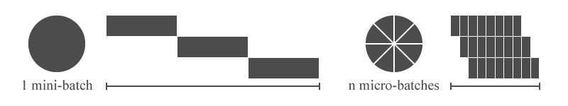
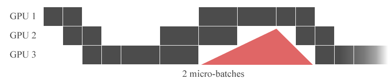

# USAGE

## Contents
- [3D Parallelism](#3d-parallelism)
    - [Model Parallelism](#model-parallelism)
    - [Data Parallelism](#data-parallelism)
    - [Training](#training)
    - [Saving Checkpoints](#saving-checkpoints)
    - [Additional Parameters](#additional-parameters)
- [Kernel Fusion](#kernel-fusion)
    - [Fused MLP and Softmax Kernels](#fused-mlp-and-softmax-kernels)
    - [Fused N-Gram Blocking Kernels](#fused-n-gram-blocking-kernels)
- [DeepSpeed Support](#deepspeed-support)
    - [Initialization](#initialization)
    - [Training](#training-1)
- [Data Processing](#data-processing)
    - [DatasetPreprocessor](#datasetpreprocessor)
    - [DatasetForCausalLM](#datasetforcausallm)
    - [DatasetBlender](#datasetblender)
    - [DistributedProxySampler](#distributedproxysampler)
    - [InfiniteDataLoader](#infinitedataloader)

## 3D Parallelism

3D parallelism makes it possible to train a large-scale model with multiple GPUs. See [this](https://huggingface.co/docs/transformers/parallelism) for the detailed explanations.

Before we go any further, OSLO parallelism must be launched with multiprocessing because it is a distributed program.
We recommend you use distributed launchers pre-built in PyTorch or DeepSpeed.
For example, you can run OSLO parallelism with four GPUs using one of the following instructions:
- `python -m torch.distributed.launch --nproc_per_node=4 YOUR_SCRIPT.py`
- `deepspeed --num_gpus=4 YOUR_SCRIPT.py`    

For more information about them, please see the document of [PyTorch](https://pytorch.org/docs/stable/distributed.html) and [DeepSpeed](https://www.deepspeed.ai/getting-started/#launching-deepspeed-training).

### Model Parallelism

OSLO provides two key methods `from_pretrained_with_parallel` and `from_config_with_parallel`.
They are inspired by `from_pretrained` and `from_config` of Transformers, so all the keyword arguments such as `pad_token_id` and `torch_dtype` can also be used. 
    
They have two key parameters `tensor_parallel_size` and `pipeline_parallel_size` which make model parallelization easy.
Note `tensor_parallel_size` * `pipeline_parallel_size` must be less than or equal to the total number of GPUs and `tensor_parallel_size` must be a power of 2. For example, (1 * 4), (2 * 2), (4 * 1) are usable options if you have four GPUs.

The followings are examples of model parallelism with four GPUs.
    
1. Parallelization of the pre-trained model on the model hub
  
```python
from oslo import GPT2LMHeadModel

model = GPT2LMHeadModel.from_pretrained_with_parallel(
    "gpt2", 
    tensor_parallel_size=2, 
    pipeline_parallel_size=2,
)
```

2. Parallelization of the pre-trained model in the local path (merged checkpoint)

```
/path/to/mdoel

- pytorch_model.bin
- config.json
```
```python
from oslo import GPT2LMHeadModel

model = GPT2LMHeadModel.from_pretrained_with_parallel(
    "/path/to/model",
    tensor_parallel_size=2,
    pipeline_parallel_size=2,
)
```

3. Parallelization of the pre-trained model in the local path (split checkpoints)

You can also create the model from split checkpoint files.
How to save the split checkpoint files will be explained later.

```
/path/to/model

- pytorch_model_tp=0_pp=0.bin
- pytorch_model_tp=1_pp=0.bin
- pytorch_model_tp=0_pp=1.bin
- pytorch_model_tp=1_pp=1.bin
- config.json
```
```python
from oslo import GPT2LMHeadModel

model = GPT2LMHeadModel.from_pretrained_with_parallel(
    "/path/to/model",
    tensor_parallel_size=2,
    pipeline_parallel_size=2,
)
```

4. Parallelization of the random-initialized model using configuration object
    
```python
from oslo import GPT2LMHeadModel, GPT2Config

config = GPT2Config.from_pretrained("gpt2")
# config = GPT2Config.from_json_file("path/to/config")
# config = GPT2Config.from_dict(YOUR_CONFIG_DICT)

model = GPT2LMHeadModel.from_config_with_parallel(
    config,
    tensor_parallel_size=2,
    pipeline_parallel_size=2,
)
```    

### Data Parallelism

In this chapter, we explain how to parallelize dataset.
You can realize 3D parallelism by combining model parallelism and data parallelism.

1. Wrapping the model

Data parallelism is available by wrapping the model with the `DistributedDataParallel` in PyTorch.
Note `model.gpu_modules()` allows you to wrap only modules on the current GPU and 
`model.mpu.get_data_parallel_group()` allows you to access to the data parallel group.
    
The data parallel size is determined by the number of GPUs remaining after the model parallelization. 
For example, if you have 16 GPUs and set `tensor_parallel_size=2` and `pipeline_parallel_size=2`, 
the data parallel size is automatically set to 4. (tensor:2 * pipeline:2 * data:4 = 16) 

```python
from torch.cuda import current_device
from torch.nn.parallel.distributed import DistributedDataParallel
from oslo import GPT2LMHeadModel

model = GPT2LMHeadModel.from_pretrained_with_parallel(
    pretrained_model_name_or_path="gpt2",
    tensor_parallel_size=2,
    pipeline_parallel_size=2,
)

model_ddp = DistributedDataParallel(
    model.gpu_modules(),
    process_group=model.mpu.get_data_parallel_group(),
    device_ids=[current_device()],
    output_device=current_device(),
)
```

2. Parallelization of the dataset

Now, you should use `DistributedSampler` to parallelize the dataset into multiple GPUs.

```python
from torch.utils.data import Dataset, DataLoader, DistributedSampler

# Prepare your dataset object
dataset: Dataset = ...

dataloader = DataLoader(
    dataset=dataset,
    num_workers=4,
    batch_size=16,
    shuffle=False,
    sampler=DistributedSampler(
        dataset=dataset,
        num_replicas=model.mpu.get_data_parallel_world_size(),
        rank=model.mpu.get_data_parallel_rank(),
    )
)
```

See the PyTorch document about [`DistributedDataParallel`](https://pytorch.org/docs/stable/generated/torch.nn.parallel.DistributedDataParallel.html#torch.nn.parallel.DistributedDataParallel) and [`DistributedSampler`](https://pytorch.org/docs/stable/data.html#torch.utils.data.distributed.DistributedSampler) if you want to learn more about them.
    
### Training

1. Creation of an optimizer

Firstly, an optimizer should be created to train the model.
Note `model.gpu_parameters()` makes it possible to extract only the parameters on the current GPU.

```python
from torch.optim import Adam

optimizer = Adam(
    params=model.gpu_parameters(),
    lr=3e-5,
    weight_decay=3e-7,
)
```

2. Forward & Backward pass without pipeline parallelism

Without pipeline parallelism, write the training loop as usual.
This is one of the common code patterns in PyTorch.

```python
for sample in loader:
    optimizer.zero_grad()

    # forward
    output = model_ddp(
        input_ids=sample["input_ids"].cuda(),
        attention_mask=sample["attention_mask"].cuda(),
        labels=sample["labels"].cuda(),
    )
    # backward
    loss = output.loss
    loss.backward()
    # step
    optimizer.step()
```

3. Forward & Backward pass with pipeline parallelism

With pipeline parallelism, write one more loop like the following code.
In the inner loop, the output of micro-batch will be generated.

```python
for sample in loader:
    optimizer.zero_grad()
    
    # forward
    for micro_output in model_ddp(
        input_ids=sample["input_ids"].cuda(),
        attention_mask=sample["attention_mask"].cuda(),
        labels=sample["labels"].cuda(),
    ):  
        # backward
        micro_loss = micro_output.loss
        micro_loss.backward()
    # step
    optimizer.step()
```

Various libraries can also be used together. 
The following is an example of mixed precision training with OSLO.

```python
import torch

scaler = torch.cuda.amp.GradScaler()

for sample in loader:
    optimizer.zero_grad()

    with torch.cuda.amp.autocast():
        # forward
        for micro_output in model_ddp(
            input_ids=sample["input_ids"].cuda(),
            attention_mask=sample["attention_mask"].cuda(),
            labels=sample["labels"].cuda(),
        ):
            # backward
            micro_loss = micro_output.loss
            scaler.scale(micro_loss).backward()
        # step
        scaler.step(optimizer)
        scaler.update()
```

### Saving Checkpoints
    
OSLO provides `save_pretrained_with_parallel` for checkpoints saving and merging.
This is inspired by `save_pretrained` of Transformers, so all the keyword arguments such as `save_config` and `save_function` can also be used. 
    
1. Saving checkpoints

`save_pretrained_with_parallel` saves split checkpoint files on each GPU with the name `pytorch_mdeol_tp=?_pp=?.bin`.

```python
model.save_pretrained_with_parallel(
    save_directory="/path/to/model"
)
```
```
/path/to/mdoel

- pytorch_model_tp=0_pp=0.bin
- pytorch_model_tp=1_pp=0.bin
- pytorch_model_tp=0_pp=1.bin
- pytorch_model_tp=1_pp=1.bin
- config.json
```


2. Merging checkpoints

The checkpoint can also be saved in the merged form if you set `save_with_merge` to True. 
We recommend using this after training because this needs high memory usage and communication cost.

```python
model.save_pretrained_with_parallel(
    save_directory="/path/to/merge",
    save_with_merging=True,
)
```
```
/path/to/merge

- pytorch_model.bin
- config.json
```

### Additional Parameters

In this chapter, we explain additional parameters of `from_pretrained_with_parallel` and `from_config_with_parallel`.

1. `micro_batch_size`

Micro-batch size is the concept introduced from pipeline parallelism and refers to a subset of mini-batch.
(Images from https://www.kakaobrain.com/blog/66)




You can set the micro-batch size using the parameter `micro_batch_size` and the default value of this is 1.
Note this parameter only affects pipeline parallelism.

```python
from oslo import GPT2LMHeadModel

model = GPT2LMHeadModel.from_pretrained_with_parallel(
    pretrained_model_name_or_path="gpt2",
    tensor_parallel_size=2,
    pipeline_parallel_size=2,
    micro_batch_size=4,
)
```

If you want to change micro-batch size after model creation, use `set_micro_batch_size`.

```python
model.set_micro_batch_size(4)
```

2. `resize_token_embeddings`

If you want to resize token embedding, input a new embedding size to `resize_token_embeddings`.

```python
from oslo import GPT2LMHeadModel

model = GPT2LMHeadModel.from_pretrained_with_parallel(
    pretrained_model_name_or_path="gpt2",
    tensor_parallel_size=2,
    pipeline_parallel_size=2,
    resize_token_embeddings=len(tokenizer),
)
```

## Kernel Fusion

Kernel fusion increases training and inference speed by optimizing GPU operations. 
Note this can also be combined with 3D parallelism.

### Fused MLP and Softmax kernels

`model.fuse()` makes kernel fusion easy.
OSLO fuses (bias addition + GeLU) and (bias addition + dropout) in the MLP layers using [the JIT compilation](https://pytorch.org/docs/stable/jit.html) and 
(scale + mask + softmax) in the Attention layers using [the kernels of NVIDIA Apex](https://github.com/NVIDIA/apex/tree/master/csrc/megatron). 

```python
model = model.fuse()

# before fusion: 4.304628610610962 sec
# after fusion:  3.859266519546509 sec
```

### Fused N-Gram Blocking Kernels

You can execute n-gram blocking on the GPU using `model.generate(..., fused_no_repeat_ngram_blocking=True)`.
OSLO uses [the kernels of Fastseq](https://github.com/microsoft/fastseq/tree/main/fastseq/clib/cuda) for this.
We observed the speed of text generation could be faster when batch size is very large. 
    
```python
model.generate(..., fused_no_repeat_ngram_blocking=True)

# before fusion: 3.859266519546509 sec
# after fusion:  3.620283210294232 sec (only helpful for large-batch)
```

## DeepSpeed Support

OSLO supports [DeepSpeed](https://github.com/microsoft/DeepSpeed) which provides ZeRO data parallelism.
However, note [ZeRO Stage 2 or higher cannot be used with pipeline parallelism](https://github.com/microsoft/DeepSpeed/issues/1110).

### Initialization

You should use `model.gpu_modules()` and `model.gpu_paramters()` when you initialize DeepSpeed engine.

```python
import deepspeed
from oslo import GPT2LMHeadModel

# Prepare your deespeed config
ds_config: dict = ...

model = GPT2LMHeadModel.from_pretrained_with_parallel(
    pretrained_model_name_or_path="gpt2",
    tensor_parallel_size=2,
    pipeline_parallel_size=2,
)

engine, _, _, _ = deepspeed.initialize(
    model=model.gpu_modules(), 
    model_parameters=model.gpu_parameters(),
    config=ds_config,
)
```

### Training

1. Forward & Backward pass without pipeline parallelism

```python
for sample in loader:
    # forward
    output = engine(
        input_ids=sample["input_ids"].cuda(),
        attention_mask=sample["attention_mask"].cuda(),
        labels=sample["labels"].cuda(),
    )
    # backward
    loss = output.loss
    engine.backward(loss)
    # step
    engine.step()
```
2. Forward & Backward pass with pipeline parallelism

```python
for sample in loader:
    # forward
    for micro_output in engine(
        input_ids=sample["input_ids"].cuda(),
        attention_mask=sample["attention_mask"].cuda(),
        labels=sample["labels"].cuda(),
    ):
        # backward
        micro_loss = micro_output.loss
        engine.backward(micro_loss)
    # step
    engine.step()
```

For more information about DeepSpeed, See [the document of DeepSpeed](https://deepspeed.ai).
    
## Data Processing

OSLO provides various utilities for the efficient large-scale data processing. 

### DatasetPreprocessor

`DatasetPreprocessor` is a preprocessor performs tokenization + encoding + binarization. 

- Args:
```
tokenizer (PreTrainedTokenizer): huggingface tokenizer object
chunk_size (int): chunk size for multiprocessing
binarization_impl (str): type of binarization implementation. one of ['mmap', 'lazy', 'cached'].
append_eod (bool): flag indication whether to apply append end of document token or not
eod_token_id (int): id of end of document token.
```    

- Notes:
      
What is the end of the document token?
      
For example, ``sentence_1`` is 'Hello I am Kevin' and ``sentence_2`` is 'I am Ryan'.
Then, we concatenate all the sentences like 'Hello I am Kevin I am Ryan' to remove all the padding tokens.
But, in this case, the distinction between documents disappears.
So, we should append the end of document token to the end of each document like 'Hello I am Kevin `<eod>` I am Ryan `<eod>`'.

What is the binarization impl?

This is how data is loaded. There are three modes.

- `cached`: This mode loads all the data into memory. This is suitable for small dataset.
- `lazy`: This mode loads the data from disk at each training step. This is suitable for large dataset.
- `mmap`:  This mode is same as `lazy` but utilizes memory mapping to reduce the speed gap between memory and disk.

Choose one of them to suit your purpose.

- Examples

```python
import os
from transformers import AutoTokenizer
from oslo import DatasetPreprocessor

data_names=[
  "/path/to/wikitext103", "/path/to/lambada", ...
]

# 1. Create tokenizer
os.environ["TOKENIZERS_PARALLELISM"] = "true"
tokenizer = AutoTokenizer.from_pretrained(...)

# 2. Create preprocessor
preprocessor = DatasetPreprocessor(
    tokenizer=tokenizer,
    binarization_impl="mmap",
    eod_token_id=tokenizer.eos_token_id,
    append_eod=True,
)

# 3-1. Preform preprocessing (.txt)
# save_file_name + '.idx' and '.bin' will be created.
for data_name in data_names:
    preprocessor.preprocess(
        open(data_name + ".txt"),
        save_file_name=data_name,
        log_interval=100,
    )

# 3-2. Perform preprocessing (.jsonl, Megatron-LM format)
# 1 {"text": "blah blah"}
# 2 {"text": "blah blah"}
# 3 ...
for data_name in data_names:
  preprocessor.preprocess(
        preprocessor.open_jsonl(
            data_name, 
            json_key="text",
        ),
        save_file_name=data_name,
        log_interval=100,
  )

# 3-3 Perform preprocessing (any other format)
for data_name in data_names:
  preprocessor.preprocess(
        YOUR_OWN_LIST_OF_STRING,
        save_file_name=data_name,
        log_interval=100,
  )
```

### DatasetForCausalLM
`DatasetForCausalLM` is the efficient dataset class for causal laungauge model training.
This class merges all the sentences as explained in `DatasetPreprocessor` chapter.

- Args

```
data_name (str): the name of dataset (data file)
max_seq_length (int): max sequence length
split_type (str): split type e.g. "train", "valid", "test"
start_weight (float): dataset start weight, default is 0.0
end_weight (float) : dataset end weight, default is 0.0
binarization_impl (str): type of binarization implementation. one of ['mmap', 'lazy', 'cached'].
seed (int): random seed value
```

- Examples

```python
from oslo import DatasetForCausalLM

# Assume that the total number of data is 10,000.
# The 0th to 7,999th samples are used as training data.
train = DatasetForCausalLM(
    data_name="/path/to/wikitext103",
    start_weight=0.0,
    end_weight=0.8,
    split_type="train",
    max_seq_length=2048,
    binarization_impl="mmap",
)

# The 8,000th to 8,999th samples are used as validation data.
valid = DatasetForCausalLM(
    data_name="/path/to/wikitext103",
    start_weight=0.8,
    end_weight=0.9,
    split_type="valid",
    max_seq_length=2048,
    binarization_impl="mmap",
)

# The 9,000th to 9,999th samples are used as test data.
test = DatasetForCausalLM(
    data_name="/path/to/wikitext103",
    start_weight=0.9,
    end_weight=1.0,
    split_type="valid",
    max_seq_length=test,
    binarization_impl="mmap",
)
```

### DatasetBlender

`DatasetBlender` is a utility to blend multiple datasets into one.

- Args

```
datasets (List[Dataset]): list of datasets
weights (Optional[List[float]]): list of dataset weights. if None, we make weight list proportional to the length of each dataset automatically.
```

You can pass the `weights` of each dataset. For example, if you have two datasets, d1 and d2, and set `weights` like `[0.7, 0.3]`.
Then, d1 appears at 70% and d2 appears at 30% during training.
If you don't input `weights`, OSLO makes them proportional to the length of each dataset automatically.

- Examples

```python
from oslo import DatasetBlender

train_dataset_list = [train1, tarin2, train3, ...]
valid_dataset_list = [valid1, valid2, valid3, ...]
test_dataset_list = [test1, test2, test3, ...]

train_dataset = DatasetBlender(train_dataset_list)
valid_dataset = DatasetBlender(valid_dataset_list)
test_dataset = DatasetBlender(test_dataset_list)
```

### DistributedProxySampler

`DistributedProxySampler` is a sampler which combines `DistributedSampler` with other sampler.
This is copied from [`catalyst.data.sampler.DistributedSamplerWarpper`](https://github.com/catalyst-team/catalyst/blob/master/catalyst/data/sampler.py).

- Args

```
sampler: Sampler used for subsampling
num_replicas (int): Number of processes participating in distributed training
rank (int): Rank of the current process within ``num_replicas``
shuffle (bool): If true, sampler will shuffle the indices
seed (int): random seed value
drop_last (bool): If true, skip last batch
```
- Examples
```python
from oslo import DistributedProxySampler
from torch.utils.data import Sampler, Dataset
import torch.distributed as dist

# Prepare your dataset and sampler
dataset: Dataset = ...
sampler: Sampler = ...

sampler = DistributedProxySampler(
    sampler=sampler,
    num_replicas=dist.get_world_size(),
    rank=dist.get_rank()
)
```
### InfiniteDataLoader

`InfiniteDataLoader` makes the dataloader loop infinitely.
This is copied from [`deepspeed.runtime.dataloader.RepeatingLoader`](https://github.com/microsoft/DeepSpeed/blob/master/deepspeed/runtime/dataloader.py).

- Examples

```python
from torch.utils.data import DataLoader
from oslo import InfiniteDataLoader

# Prepare your dataloader
dataloader: DataLoader = ...

dataloader = InfiniteDataLoader(dataloader)

for data in dataloader:
    # infinitely repeating !
    pass
```
